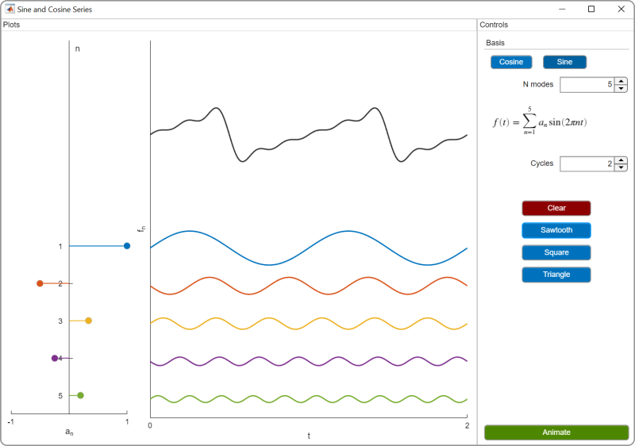
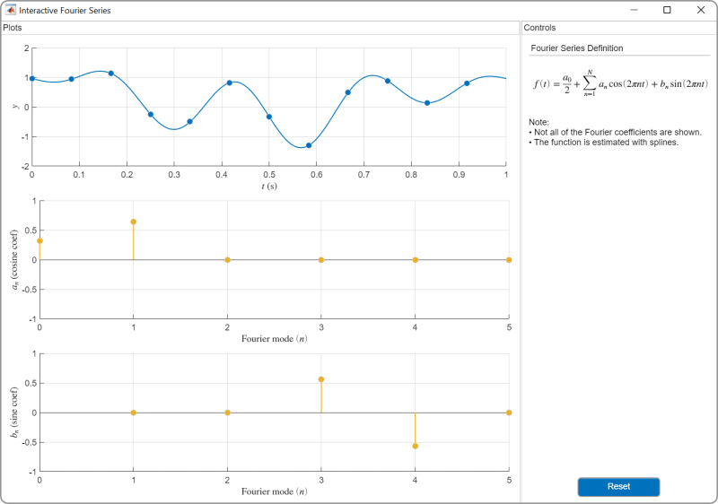
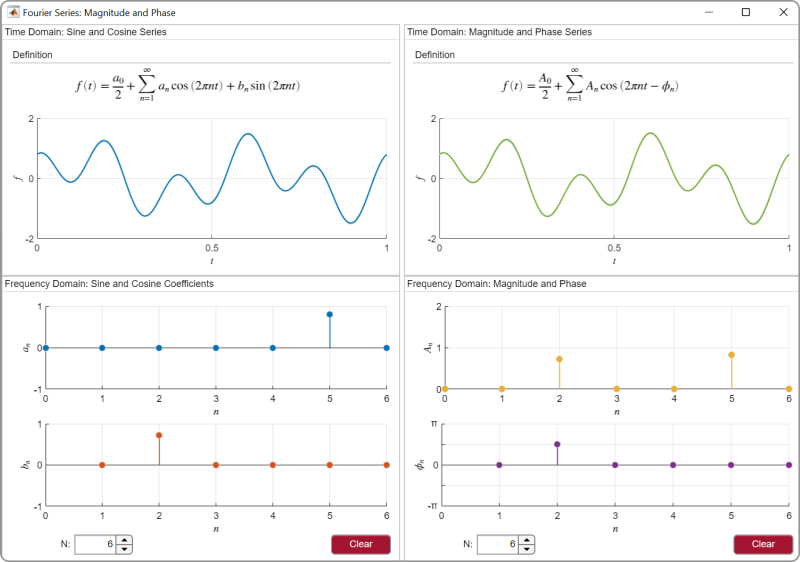
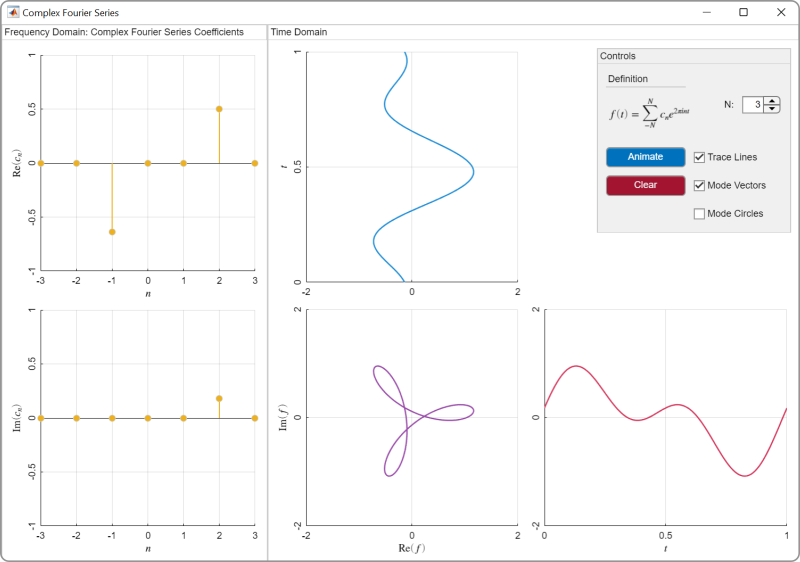

# フーリエ解析

 or 

**Curriculum Module**

_Created with R2021b. Compatible with R2024a and later releases._

# 情報

このカリキュラムモジュールには、フーリエ解析の基本概念を教えるインタラクティブな[MATLAB® ライブスクリプト](https://www.mathworks.com/products/matlab/live-editor.html)と[MATLAB® アプリ](https://www.mathworks.com/products/matlab/app-designer.html)が含まれています。

## 背景

このモジュールは、信号処理の観点から、入門レベルの信号システムのコースに適したレベルで教えられます。最初のレッスンでは、学生はアプリを使ってフーリエ級数を視覚化し、周波数領域についての直感を養います。続くレッスンでは、複素フーリエ級数、フーリエ変換、離散フーリエ変換を学びます。学生が進むにつれて、アプリの利用から自分でコードを書いて信号を解析する段階へと移行します。モジュール全体を通して、学生は録音された音声信号の解析にフーリエ解析を用います。

ライブスクリプト内の指示により、演習や実際の操作の手順を案内します。各ライブスクリプトは、セクションごとに実行しながら始めてください。スクリプトやセクションの実行を途中で停止したい場合（例：アニメーションが進行中の場合）、MATLABツールストリップの**ライブエディター**タブ内の**実行**セクションにある停止ボタンを使用してください。

このモジュールは英語から自動翻訳されています。

## お問い合わせ

解答は教員からのリクエストに応じて提供可能です。解答のリクエスト、フィードバックの提供、ご質問がある場合は、[MathWorks 教育リソースチーム](mailto:onlineteaching@mathworks.com)までご連絡ください。

## 前提条件

このモジュールは、これらのスクリプトに必要な最小限のMATLAB知識を前提としていますが、[MATLAB入門](https://matlabacademy.mathworks.com/details/matlab-onramp/gettingstarted)を活用することで、ライブスクリプトやMATLAB構文に慣れるためのリソースとして利用できます。

## はじめに
### モジュールへのアクセス
### **MATLAB Onlineの場合:**

リンクを使用してモジュールをダウンロードしてください。ログインまたはMathWorksアカウントの作成を求められます。プロジェクトが読み込まれ、開始するための複数のナビゲーションオプションを備えたアプリが表示されます。

### **デスクトップの場合:**

このリポジトリをダウンロードまたはクローンしてください。MATLABを開き、これらのスクリプトが含まれるフォルダーに移動し、[fourier\-analysis.prj](<matlab: openProject("fourier-analysis.prj")>)をダブルクリックします。必要なファイルがMATLABパスに追加され、開始場所を尋ねるアプリが開きます。

必要なすべての製品（[下記に一覧](#H_E850B4FF)）がインストールされていることを確認してください。製品を追加する必要がある場合は、Add\-On Explorerを使って追加してください。アドオンをインストールするには、**ホーム**タブに移動し、 **アドオン** > **アドオン入手**を選択します。

## 製品

MATLAB®、Symbolic Math Toolbox™

# スクリプト
## [**FourierSeries.mlx**](./Scripts/FourierSeries.mlx)
|  | **このスクリプトで学生は...**    | **実験課題**     |
| :-- | :-- | :-- |
|     | $\bullet$ 時間領域と周波数領域で信号を比較   $\bullet$ 周波数領域で音声信号を解析   $\bullet$ フーリエ級数を視覚化   $\bullet$ フーリエ級数における位相シフトの表現方法を説明   $\bullet$ 振幅と位相について議論    | [Lab1\_FourierSeries.mlx](./Scripts/Lab1_FourierSeries.mlx)     |

## [**ComplexFourierSeries.mlx**](./Scripts/ComplexFourierSeries.mlx)
|  | **このスクリプトで学生は...**    | **実験課題**     |
| :-- | :-- | :-- |
|     | $\bullet$ 時間領域と周波数領域で信号を比較   $\bullet$ 周波数領域で音声信号を解析   $\bullet$ フーリエ級数を視覚化   $\bullet$ フーリエ級数における位相シフトの表現方法を説明   $\bullet$ 振幅と位相について議論    | [Lab2\_ComplexFourierSeries.mlx](./Scripts/Lab2_ComplexFourierSeries.mlx)     |

## [**FourierTransform.mlx**](./Scripts/FourierTransform.mlx)
|  | **このスクリプトで学生は...**    | **実験課題**     |
| :-- | :-- | :-- |
|     | $\bullet$ 時間領域と周波数領域で信号を比較   $\bullet$ 周波数領域で音声信号を解析   $\bullet$ フーリエ級数を視覚化   $\bullet$ フーリエ級数における位相シフトの表現方法を説明   $\bullet$ 振幅と位相について議論    | [Lab3\_FourierTransform.mlx](./Scripts/Lab3_FourierTransform.mlx)     |

## [**DiscreteFourierTransform.mlx**](./Scripts/DiscreteFourierTransform.mlx)
|  | **このスクリプトで学生は...**    | **実験課題**     |
| :-- | :-- | :-- |
|     | $\bullet$ 時間領域と周波数領域で信号を比較   $\bullet$ 周波数領域で音声信号を解析   $\bullet$ フーリエ級数モードを視覚化   $\bullet$ フーリエ級数における位相シフトの表現方法を説明   $\bullet$ 振幅と位相について議論    | [Lab4\_DFT.mlx](./Scripts/Lab4_DFT.mlx)     |

# アプリ
| [フーリエ級数アプリ(sinまたはcosのみで波形の重ね合わせを表現)](<<matlab:run SinCosSeries.mlapp>;>)     | [フーリエ級数アプリ(sin項およびcos項の係数変更による合成波形の可視化)](<<matlab:run InteractiveFourierSeries.mlapp>;>)    |  [振幅と位相での表現を可視化するアプリ](<<matlab:run MagnitudePhase.mlapp>;>)     | [複素フーリエ級数を可視化するアプリ](<<matlab:run ComplexFourierSeries.mlapp>>)     |
| :-- | :-- | :-- | :-- |
|     |     |     |      |

# 教育者向けリソース
-  [MATLABを使って教える](https://www.mathworks.com/academia/educators.html) 

Copyright 2025 The MathWorks™, Inc

